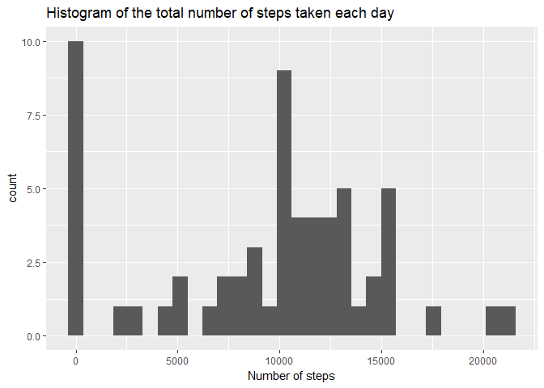
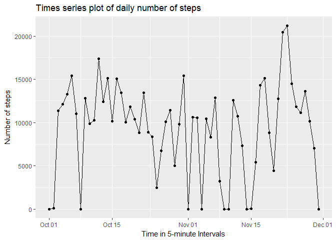
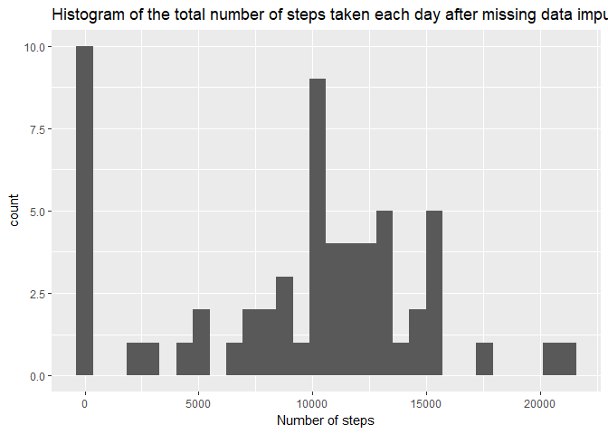
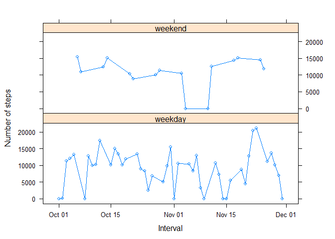

# Reproducible Research: Peer Assessment 1


## Loading and preprocessing the data


The dataset is stored in a comma-separated-value (CSV) file in the working directory, and is loaded into RStudio using the codes below: 


```r
activity <- read_csv(file = "activity.csv", col_names = TRUE, na = c("", "NA"))
```

```
## Parsed with column specification:
## cols(
##   steps = col_integer(),
##   date = col_date(format = ""),
##   interval = col_integer()
## )
```


See the top portion of the dataset below


```r
head(activity)
```

```
## # A tibble: 6 x 3
##   steps       date interval
##   <int>     <date>    <int>
## 1    NA 2012-10-01        0
## 2    NA 2012-10-01        5
## 3    NA 2012-10-01       10
## 4    NA 2012-10-01       15
## 5    NA 2012-10-01       20
## 6    NA 2012-10-01       25
```


And the bottom portion of the dataset is shown below:


```r
tail(activity)
```

```
## # A tibble: 6 x 3
##   steps       date interval
##   <int>     <date>    <int>
## 1    NA 2012-11-30     2330
## 2    NA 2012-11-30     2335
## 3    NA 2012-11-30     2340
## 4    NA 2012-11-30     2345
## 5    NA 2012-11-30     2350
## 6    NA 2012-11-30     2355
```


## What is mean total number of steps taken per day?


The missing values in the dataset are ignored for now. The steps in the analysis are as follows:
1.	Calculate the total number of steps taken per day
2.	Make a histogram of the total number of steps taken each day


```r
T_steps <- activity %>% count(date, wt = steps)

ggplot(T_steps, aes(x = n)) + geom_histogram() + labs(title = "Histogram of the total number of steps taken each day", 
    x = "Number of steps")
```

```
## `stat_bin()` using `bins = 30`. Pick better value with `binwidth`.
```

<!-- -->


The mean and median of the total number of steps taken per day are calculated respectively as follows:


```r
mn <- mean(T_steps$n, na.rm = TRUE)
md <- median(T_steps$n, na.rm = TRUE)
```


The mean total number of steps taken per day is 9354.2295082, and the median is 10395.


## What is the average daily activity pattern?


#### Which 5-minute interval, on average across all the days in the dataset, contains the maximum number of steps?


To answer these, a time series plot is constructed as follows:


```r
ggplot(T_steps, aes(x = date, y = n)) + geom_line() + geom_point() + labs(title = "Times series plot of daily number of steps", 
    x = "Time in 5-minute Intervals", y = "Number of steps")
```

<!-- -->


Reading directly off the time series plot, the maximum number of steps occurs on 2012-11-23. This iformation can also be directly be extracted from the processed data:


```r
print(filter(T_steps, n == max(T_steps$n, na.rm = TRUE)))
```

```
## # A tibble: 1 x 2
##         date     n
##       <date> <int>
## 1 2012-11-23 21194
```


## Imputing missing values


There are a number of days/intervals where there are missing values (coded as NA). The presence of missing days may introduce bias into some calculations or summaries of the data. 


####	Calculate and report the total number of missing values in the dataset (i.e. the total number of rows with NAs)


Here are the codes to determine the number of rows with NAs in each of the three variables:


```r
n1 <- sum(is.na(activity$steps))
n2 <- sum(is.na(activity$date))
n3 <- sum(is.na(activity$interval))
```


The results show 2304, 0, and 0 NAs respectively for variables *steps*, *date*, and *interval*, that is, all NAs come from only the *steps* variable. This translates to a total 2304 rows in the data that have NAs. 


#### Devise a simple strategy for filling in all of the missing values in the dataset. 


A new dataset "activity2" that is equal to the original dataset "activity" but with the missing data filled in is created using the median for that day:


```r
activity2 <- activity %>% mutate(steps2 = impute(steps, median)) %>% select(steps2, 
    date, interval)
```


#### Make a histogram of the total number of steps taken each day


Again, first compute the total number of steps taken each day:


```r
T_steps2 <- activity2 %>% count(date, wt = steps2)
```


Then plot the histogram of the number of steps:

 

```r
ggplot(T_steps2, aes(x = n)) + geom_histogram() + labs(title = "Histogram of the total number of steps taken each day after missing data imputation", 
    x = "Number of steps")
```

```
## `stat_bin()` using `bins = 30`. Pick better value with `binwidth`.
```

<!-- -->


###     Do these values differ from the estimates from the first part of the report? 


###     What is the impact of imputing missing data on the estimates of the total daily number of steps? 


The mean and median total number of steps taken per day are re-calculated:


```r
mn2 <- round(mean(T_steps2$n, na.rm = TRUE), 1)
md2 <- median(T_steps2$n, na.rm = TRUE)
```


The recalculated mean and median total number of steps taken per day are 9354.2  and 10395 respectively. From these results there is no difference between the estimates from the original and imputed data. Missing data imputation has no impact.


## Are there differences in activity patterns between weekdays and weekends?


This question is answered in two sub-steps. 

First:

* The dataset with the filled-in missing values is used.
* A new factor variable is created in the dataset with two levels - "weekday" and "weekend" indicating whether a given date is a weekday or weekend day.
* The weekdays() function is used to identify weekday and weekend days.

 

```r
T_steps2b <- T_steps2 %>% mutate(day = as.factor(ifelse(weekdays(T_steps2$date) == 
    "Saturday" | weekdays(T_steps2$date) == "Sunday", "weekend", "weekday")))
```


Second, a panel plot containing a time series plot of the average number of steps by weekday vs. weekend days is constructed:


```r
xyplot(n ~ date | day, data = T_steps2b, layout = c(1, 2), ylab = "Number of steps", 
    xlab = "Interval", panel = function(x, y, ...) {
        panel.xyplot(x, y, ..., type = "b")
    })
```

<!-- -->

